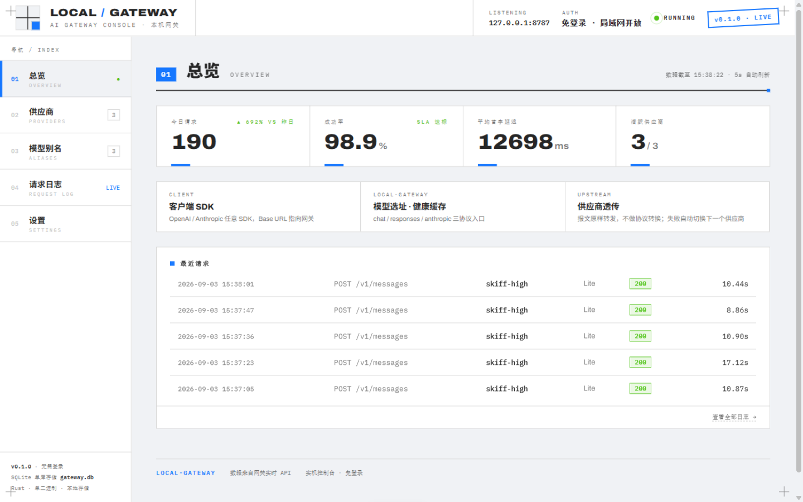
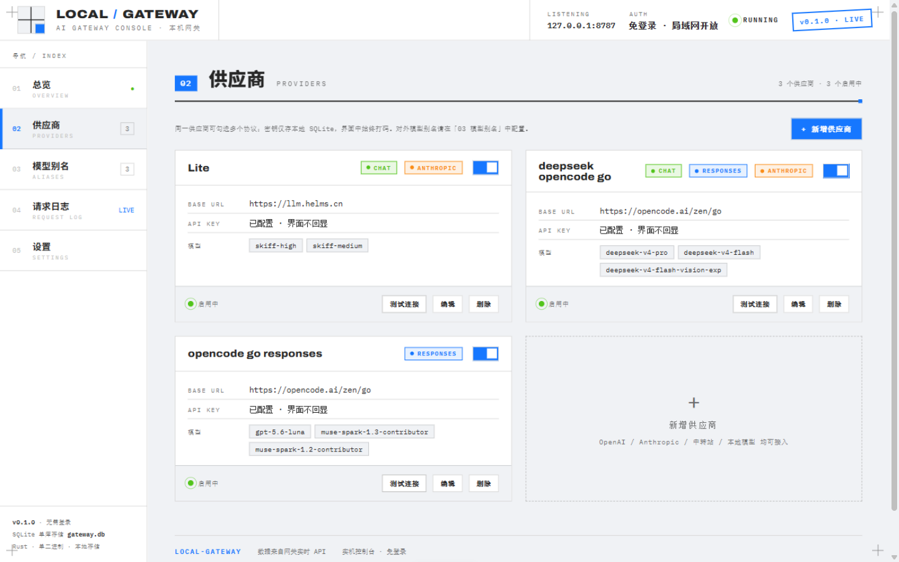
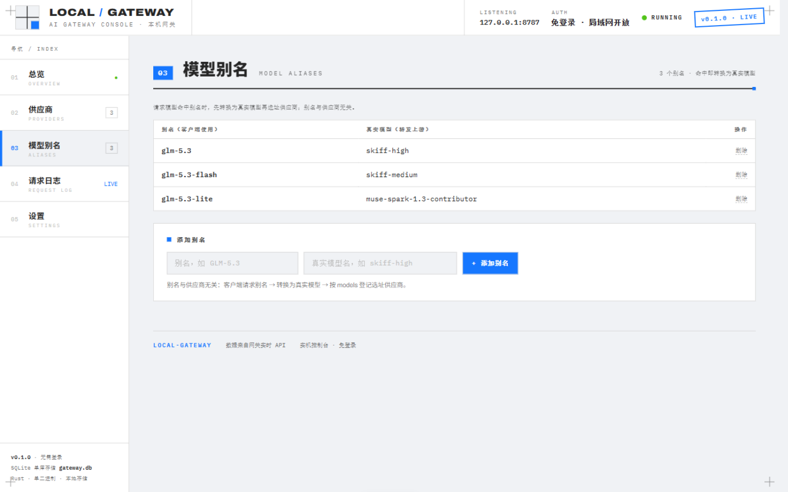
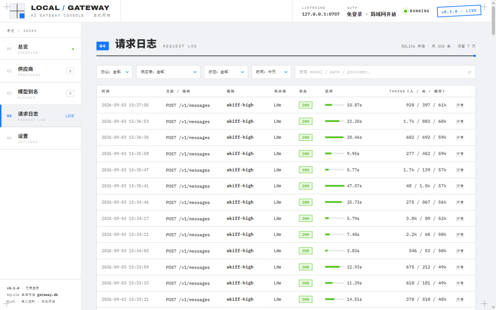
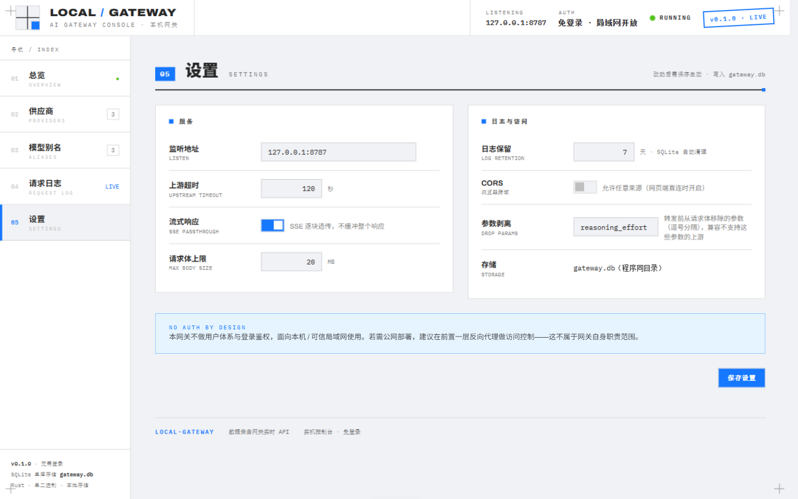

# LOCAL/GATEWAY

单二进制本地 LLM 网关（Rust / axum 0.8）。把 OpenAI Chat、OpenAI Responses 与 Anthropic 三种协议的请求透明转发给多个上游供应商：**不做协议转换**（入站什么协议，出站就用同一协议），按模型名自动选址，429/5xx 自动切换下一个供应商，并内置一个免登录的 Web 控制台。



## 特性

- **三协议透传**：`POST /v1/chat/completions`、`POST /v1/responses`、`POST /v1/messages`，报文原样转发，SSE 流式逐块透传。
- **模型选址与故障转移**：请求 `model` 直接写真实模型名，网关在登记了该模型的供应商中选址（优先上次成功的健康供应商）；仅在 429/5xx 且还有候选时切换，其余 4xx 原样透传。
- **模型别名**：全局别名单跳解析，命中后先转换为真实模型再选址，客户端无感知迁移供应商。
- **密钥本地保管**：各供应商的 API Key 只存在本地 SQLite，转发时由网关注入（OpenAI 风格 `Authorization: Bearer`、Anthropic 风格 `x-api-key`），客户端无需携带真实密钥。
- **内置控制台**：总览统计、供应商管理（含连通性测试）、别名管理、请求日志（attempts / 用量 / 延迟）、设置，5 秒自动刷新。
- **单文件存储**：全部配置与日志持久化在 exe 同级目录的 `gateway.db`（SQLite），无配置文件，删库即重置。
- **drop_params**：转发前从请求体剥离指定参数（默认 `reasoning_effort`），兼容不支持这些参数的上游。

## 快速开始

```bash
cargo run
```

默认监听 `127.0.0.1:8787`，浏览器打开 <http://127.0.0.1:8787/> 进入控制台，先在「供应商」里添加上游（OpenAI / Anthropic / 中转站 / 本地模型均可），再按需配置模型别名。

也可以直接从 [GitHub Releases](../../releases) 下载对应平台的单文件可执行程序（Windows x64/arm64、macOS x64/arm64），推送 master 的 CI 会自动测试、构建并发布。

## 客户端接入

任意 OpenAI / Anthropic SDK 把 Base URL 指向网关即可，`model` 写真实模型名或别名：

```bash
# OpenAI Chat 协议
curl http://127.0.0.1:8787/v1/chat/completions \
  -H "Content-Type: application/json" \
  -d '{"model":"deepseek-v4-pro","messages":[{"role":"user","content":"你好"}]}'

# OpenAI Responses 协议
curl http://127.0.0.1:8787/v1/responses -H "Content-Type: application/json" -d '{"model":"...","input":"你好"}'

# Anthropic 协议
curl http://127.0.0.1:8787/v1/messages -H "Content-Type: application/json" \
  -d '{"model":"...","max_tokens":1024,"messages":[{"role":"user","content":"你好"}]}'
```

## 控制台

**供应商**：增删改上游，勾选支持的协议、登记模型、配置超时与自定义头（例如 Azure 的 `api-key`），支持一键连通性测试；密钥始终打码不回显。



**模型别名**：客户端使用的名称 → 真实模型名，与供应商无关，仅单跳解析（不链式）。



**请求日志**：每次请求记录协议、模型（只记真实模型名，不记别名）、选址 attempts、状态码、延迟与 token 用量（含缓存命中），按保留天数自动清理。



**设置**：监听地址（改动需重启进程）、上游超时、SSE 直通、请求体上限、CORS、日志保留天数、drop_params，保存即时生效。



## 转发行为细节

- `base_url` 自动归一化（去尾部 `/` 与 `/v1`），转发时补回协议对应路径。
- 全部候选失败时，最后一个上游的错误体原样回传；网关自产 502 仅限传输层故障（连接失败/超时）。
- 上游响应只透传白名单响应头；流式响应逐块透传，超时仅约束「等待响应头」阶段。
- 模型名匹配忽略大小写；请求日志在网关自身拒绝时同样落库，保证统计反映全部流量。

## 配置参考

设置项均持久化在 SQLite 的 `settings` 表，通过控制台或 `PUT /admin/api/settings` 修改（唯一写入口是 `AppState::update_config`：校验 → 写库 → 原子替换内存缓存）：

| 设置项 | 默认值 | 说明 |
| --- | --- | --- |
| `listen` | `127.0.0.1:8787` | 监听地址，改动需重启进程 |
| `upstream_timeout_secs` | `120` | 等待上游响应头的超时（近似首字延迟上限） |
| `sse_passthrough` | `true` | SSE 流式逐块直通 |
| `max_body_mb` | `20` | 请求体大小上限 |
| `cors` | `false` | 允许浏览器跨域调用 |
| `retention_days` | `7` | 请求日志保留天数 |
| `drop_params` | `reasoning_effort` | 转发前剥离的参数名（逗号分隔） |

日志级别走 `RUST_LOG`（EnvFilter，默认 `info`）。

## 开发

```bash
cargo test            # 单元测试 + e2e（本地随机端口起真实服务，秒级完成）
cargo build --release # LTO + strip，产出单二进制
```

- `console.html` 与 `live.js` 通过 `include_str!` 编译进二进制，改前端必须重新编译才生效。
- 修改转发、选址或日志逻辑时，需同步更新 `src/main.rs` e2e 中的断言。

目录结构：

```
src/
├── main.rs    # 入口 + 路由 + e2e 测试
├── proxy.rs   # 转发管线：别名解析 → drop_params → 选址 → 故障转移 → 用量统计 → 日志落库
├── route.rs   # 模型→供应商选址（健康缓存优先）
├── config.rs  # 配置模型与校验（持久化在 SQLite）
├── db.rs      # SQLite schema、迁移与查询
├── state.rs   # AppState 与配置热更新
├── admin.rs   # 管理 API + 内嵌控制台
├── console.html / live.js  # 控制台前端（编译期内嵌）
```
